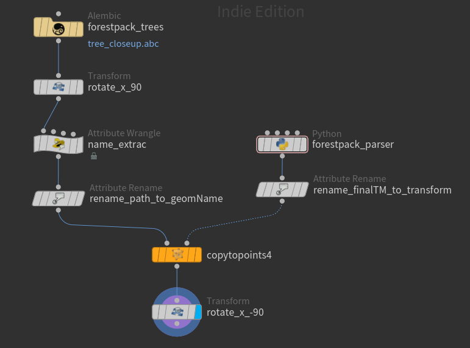

# ForestPack XML Importer for Houdini

This repository provides two small utilities (Python SOP + VEX snippets) to help bring **ForestPack** scatter data (from 3ds Max) into Houdini for further look-dev, lighting, or simulation work.

---

## Features

- **Python SOP**:  
  - Reads a Forest Pack XML file exported from 3ds Max.  
  - Creates one point per scattered item.  
  - Extracts attributes:
    - `geoID` (integer ID)  
    - `geomName` (original asset name)  
    - `finalTM` (row-major 4×4 transform matrix, with translation scaled down by `0.001`)  
  - Adds a global attribute `import_count` with the number of items imported.  

- **VEX Snippets**:  
  - Extract the last element of a path attribute (after the last `/`). 

---

## Usage

### 1. Python SOP Node

1. Create a **Python SOP** in Houdini.  
2. Add a **String parameter** to the node and name it `xmlfile`.  
3. Paste the [python_sop.py](./python_sop.py) code into the Python SOP.  
4. Point the `xmlfile` parameter to your Forest Pack XML file.  
5. Cook the node. You will get one point per scattered item, with the attributes above.

---

### 2. VEX Snippets

**Extract last block from path:**

```c
string parts[] = split(s@path, "/");
s@last = parts[len(parts)-1];


